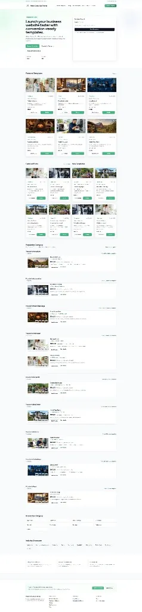

# Mateo ConsultOps Themes

Premium SaaS-style website template marketplace for **Mateo Consulting Tech**. Customers browse industry-specific HTML themes, inspect live Crafto-based demos with Mateo branding, purchase via Stripe, and download full website packages. Built with FastAPI, Jinja2, Tailwind CSS (CDN), Alpine.js, and SQLAlchemy 2.x.

---

## Table of contents

- [Overview](#overview)
- [Application capabilities](#application-capabilities)
- [Route reference](#route-reference)
- [Architecture](#architecture)
- [Data model](#data-model)
- [Services layer](#services-layer)
- [Templates and UI components](#templates-and-ui-components)
- [Live preview system](#live-preview-system)
- [Commerce and fulfillment](#commerce-and-fulfillment)
- [Configuration](#configuration)
- [Quick start](#quick-start)
- [Docker](#docker)
- [Template catalog](#template-catalog)
- [Template images](#template-images)
- [Testing and QA audits](#testing-and-qa-audits)
- [Project structure](#project-structure)

---

## Overview

Mateo ConsultOps Themes is a production-oriented template store—not a ThemeForest clone. It reuses **Crafto HTML demos** (`crafto-html-templates/`) as composable building blocks, rewrites branding and navigation for Mateo, and wraps demos in a first-party live preview chrome (desktop / tablet / mobile viewports, sticky toolbar, purchase CTA).

### Homepage

Pixel-accurate capture of the marketplace homepage (`/`)—hero, template search, featured grid, best sellers / new templates, and popular-by-category rows.



*Captured from the running app via Playwright. See [docs/figma-mcp-homepage-capture.md](docs/figma-mcp-homepage-capture.md) to refresh (Figma MCP is optional when Cursor OAuth works).*

| Layer | Technology |
|-------|------------|
| API & routing | FastAPI |
| Views | Jinja2 (`app/templates/`) |
| Styling | Tailwind CSS (CDN) + `app/static/css/marketplace.css` |
| Interactivity | Alpine.js, `app/static/js/app.js` |
| Persistence | SQLAlchemy 2.x (SQLite local, PostgreSQL-ready via `DATABASE_URL`) |
| Migrations | Alembic scaffold (`alembic/`) |
| Payments | Stripe Checkout + webhooks |
| Email | SMTP fulfillment after purchase |
| CRM handoff | ConsultOps integration API (contact form) |

**Brand palette:** `#10B981`, `#047857`, `#FFFFFF`, `#111827`, `#6B7280`, `#E5E7EB`.

---

## Application capabilities

### Marketplace discovery

- **Homepage** (`/`): featured templates, best sellers, new arrivals, and per-category popular sections (see [Homepage](#homepage) screenshot above).
- **Browse** (`/popular`): ThemeForest-inspired filters—search query, category, industry, price range, sort order—with pagination (30 per page).
- **Legacy alias** (`/marketplace`): 301 redirect to `/popular` preserving query string.
- **Category landing** (`/categories/{slug}`): filtered grid with sort and pagination.
- **Industry landing** (`/industries/{slug}`): same pattern, industry-scoped (9 per page).
- **Template cards** include thumbnail, title, category, industry, price, rating, sales count, last updated, **Live Preview**, and **Details** links.

### Template detail

- **Detail page** (`/templates/{slug}`): hero, gallery, pricing, rating, sales count, version, feature list, related templates, purchase CTA, preview CTA, and upsells (setup / hosting / maintenance flags from the database).
- Related templates are chosen from the same category, ranked by sales and rating.

### Live preview

- **Wrapped preview** (`/preview/{slug}`, `/preview/{slug}/{page}`): serves Crafto HTML inline (no iframe) with Mateo preview chrome, link rewrites, brand asset replacement, and per-slug template imagery.
- **Preview pages:** `home`, `about`, `services`, `contact`.
- **Preview-site aliases** (`/preview-site/...`): redirect into `/preview/...` for stable deep links.
- Chrome toolbar: Mateo logo (before Home tab), Back, page tabs, desktop/tablet/mobile viewport toggles, Purchase.
- Canonical preview assets: `mateo-favicon.ico`, `logo-black.png` (via `rewrite_crafto_brand_assets()`).

### Commerce

- **Purchase flow** (`/purchase/{slug}`): Stripe Checkout session creation; records `Purchase` + `Customer`.
- **Webhook** (`POST /webhooks/stripe`): signature verification, idempotent `StripeWebhookEvent` logging, marks purchases paid, triggers fulfillment email.
- **Downloads** (`/downloads`): self-service lookup by purchase email; signed token links.
- **Secure download** (`/downloads/theme/{slug}?token=...`): HMAC-signed, time-limited ZIP of the purchased theme package.
- **Resend** (`POST /downloads/resend`): regenerate fulfillment email for a purchase.

### Services and content pages

- Pricing (`/pricing`), setup services (`/services/setup`), FAQ (`/faq`), About (`/about`).
- Contact (`/contact`) with honeypot + math captcha; submits to ConsultOps when configured (`POST /api/contact`).

### Admin operations

- **Dashboard** (`/admin`): store stats, recent templates, webhook and fulfillment email queues with filters and retry actions.
- **Webhook resolve** (`POST /admin/webhooks/resolve`), **fulfillment retry** (`POST /admin/fulfillment/retry`).

### SEO, accessibility, and performance

- Per-page `meta_title` and `meta_description`; semantic HTML structure.
- Reusable responsive image partials with lazy loading.
- Pagination on browse and landing pages.

---

## Route reference

| Method | Path | Purpose |
|--------|------|---------|
| GET | `/` | Homepage |
| GET | `/popular` | Browse / filter templates |
| GET | `/marketplace` | Redirect → `/popular` |
| GET | `/categories/{slug}` | Category landing |
| GET | `/industries/{slug}` | Industry landing |
| GET | `/templates/{slug}` | Template detail |
| GET | `/preview/{slug}` | Redirect → `/preview/{slug}/home` |
| GET | `/preview/{slug}/{page}` | Live wrapped preview HTML |
| GET | `/preview-site/{slug}` | Redirect to preview home |
| GET | `/preview-site/{slug}/{page}` | Redirect to preview page |
| GET | `/pricing` | Licensing and pricing |
| GET | `/services/setup` | Setup services |
| GET | `/contact` | Contact form |
| POST | `/api/contact` | Proxy to ConsultOps contacts API |
| GET | `/faq` | FAQ |
| GET | `/about` | About |
| GET | `/downloads` | My Downloads (email lookup) |
| POST | `/downloads/resend` | Resend fulfillment email |
| GET | `/purchase/{slug}` | Purchase page |
| POST | `/purchase/{slug}` | Create Stripe Checkout session |
| POST | `/webhooks/stripe` | Stripe webhook handler |
| GET | `/downloads/theme/{slug}` | Signed ZIP download |
| GET | `/admin` | Admin dashboard |
| POST | `/admin/webhooks/resolve` | Mark webhook processed |
| POST | `/admin/fulfillment/retry` | Retry failed fulfillment email |
| GET | `/health` | Health check JSON |

**Static mounts:** `/static` → `app/static/`; `/crafto` → `crafto-html-templates/` (when present).

**Sort options** (`sort` query on browse pages): `newest`, `price_low_high`, `price_high_low`, `bestselling`, `top_rated`.

---

## Architecture

```text
HTTP Request
    │
    ▼
app/main.py          FastAPI app, static mounts, router includes
    │
    ├── app/routers/public.py   Marketplace, preview, purchase, webhooks, downloads
    └── app/routers/admin.py    Operations dashboard
    │
    ▼
app/services/        Business logic (marketplace queries, preview wrap, ZIP build, email)
    │
    ▼
app/models/          SQLAlchemy entities
    │
    ▼
app/core/database.py Session + engine (SQLite or PostgreSQL)
```

**Request rendering:** `app/utils/templating.py` exposes `render()` for Jinja2 templates with shared context.

**Configuration:** `app/core/config.py` loads `Settings` from environment / `.env` via Pydantic Settings.

**Seeding:** `python -m app.seed.seed` loads categories, industries, templates, features, reviews, and service add-ons from `app/seed/data.py`.

---

## Data model

| Entity | Role |
|--------|------|
| `Category` | Template grouping (e.g. Technology, Healthcare) |
| `Industry` | Vertical targeting (e.g. IT Consulting, Tourism) |
| `Template` | Core product: slug, price, rating, sales, flags (`is_featured`, `is_best_seller`, `is_new`), upsell flags |
| `TemplateImage` | Gallery images with sort order |
| `TemplateVersion` | Version history / changelog |
| `Feature` | Bullet features on detail pages |
| `Review` | Customer reviews per template |
| `Customer` | Buyer profile (email unique) |
| `Purchase` | Paid order linked to template + customer |
| `Inquiry` | Stored contact interest (optional local persistence) |
| `ServiceAddon` | Setup / customization add-ons |
| `LivePreview` | Preview metadata records |
| `StripeWebhookEvent` | Auditable webhook log (idempotent on `event_id`) |
| `FulfillmentEmail` | Outbound download email attempts and status |

On startup, `Base.metadata.create_all()` ensures tables exist for local dev; use Alembic for production migrations.

---

## Services layer

| Module | Responsibility |
|--------|----------------|
| `marketplace.py` | Categories, industries, filtering, sorting, pagination, featured studios, popular-by-category sections, related templates |
| `crafto_demos.py` | Maps each template `slug` → Crafto HTML files and layout key |
| `crafto_preview_wrap.py` | Loads Crafto HTML, injects chrome, rewrites links/branding/titles/images, normalizes viewport |
| `preview_demos.py` | Jinja-based demo layouts and rich page content for non-Crafto paths |
| `preview_demo_content.py` | Per-slug rich marketing copy for demo sections |
| `theme_packages.py` | Builds downloadable ZIP (multi-page HTML + CSS + JS) per template |
| `fulfillment.py` | SMTP fulfillment emails with signed download URLs |

**Preview wrap pipeline** (`load_wrapped_crafto_preview`):

1. Resolve Crafto file from `crafto_demos.CRAFTO_TEMPLATE_DEMOS`.
2. Rewrite `href` / `src` to `/preview/{slug}/{page}` (no `/crafto/#` or bare `#` in output).
3. Replace favicon and logos with Mateo canonical assets.
4. Replace visible Crafto / ThemeZaa copy with Mateo Consulting Tech.
5. Set preview `<title>` to the canonical Mateo preview title.
6. Inject WebP images from `app/static/images/templates/{slug}/`.
7. Wrap body in preview canvas + render `components/preview_chrome.html`.

---

## Templates and UI components

### Page templates (`app/templates/pages/`)

| Template | Route(s) |
|----------|----------|
| `home.html` | `/` |
| `popular.html` | `/popular` |
| `category.html` | `/categories/{slug}` |
| `industry.html` | `/industries/{slug}` |
| `template_detail.html` | `/templates/{slug}` |
| `purchase.html` | `/purchase/{slug}` |
| `my_downloads.html` | `/downloads` |
| `pricing.html` | `/pricing` |
| `services_setup.html` | `/services/setup` |
| `contact.html` | `/contact` |
| `faq.html` | `/faq` |
| `about.html` | `/about` |
| `admin_dashboard.html` | `/admin` |

### Reusable components (`app/templates/components/`)

| Component | Purpose |
|-----------|---------|
| `template_card.html` | Marketplace grid card |
| `template_list_row.html` | Compact list row variant |
| `browse_filters.html` | Search, price, sort controls |
| `browse_sidebar.html` | Category / industry sidebar |
| `category_nav.html` | Category navigation chips |
| `subcategory_pills.html` | Subcategory filters |
| `popular_category_section.html` | Homepage category blocks |
| `breadcrumbs.html` | Wayfinding |
| `pagination.html` | Page navigation |
| `preview_chrome.html` | Live preview sticky toolbar |
| `responsive_hero_image.html` | Hero with mobile variant |
| `responsive_card_image.html` | Card thumbnails |
| `responsive_gallery_image.html` | Detail gallery lazy images |

### Demo layouts (`app/templates/demos/`)

Industry-specific Jinja layouts (`layouts/`: agrarian, contractor, restaurant, saas-tech, lodge, petcare, nonprofit, realty, garage, wellness) and partials for nav, banners, inner pages, and premium home sections—used where Jinja demos complement Crafto previews.

### Base layout

- `base.html`: marketplace shell, header/footer, Mateo branding, Tailwind + Alpine, global meta tags.

### Static assets (`app/static/`)

| Path | Contents |
|------|----------|
| `css/marketplace.css` | Store UI, cards, filters, Mateo header logo sizing |
| `css/preview-chrome.css` | Live preview toolbar and viewport frame |
| `css/preview-mobile.css` | Mobile preview chrome adjustments |
| `js/app.js` | Marketplace interactions |
| `js/preview-chrome.js` | Viewport mode switching |
| `images/templates/{slug}/` | Per-template WebP sets |
| `images/logos/` | `logo-black.png`, `mateo-favicon.ico` |

---

## Live preview system

```text
/preview/{slug}/home
        │
        ▼
get_crafto_demo_or_default(slug)
        │
        ▼
Read crafto-html-templates/{demo-file}.html
        │
        ▼
crafto_preview_wrap.wrap_crafto_html()
  • rewrite_crafto_preview_links
  • rewrite_crafto_brand_assets / rewrite_crafto_brand_copy
  • rewrite_crafto_head_title
  • inject_template_preview_images
  • inject preview_chrome + canvas CSS/JS
        │
        ▼
HTMLResponse (full page, no iframe)
```

**Mateo brand rules (wrapped previews):**

- Favicon: `/static/images/logos/mateo-favicon.ico`
- Logo: `/static/images/logos/logo-black.png` with class `mkt-mateo-brand-logo`
- Desktop logo cap: 56px × 220px; mobile: 34px × 170px
- Logo appears in chrome **before** the Home tab on every preview page

---

## Commerce and fulfillment

```text
Customer → /purchase/{slug} → Stripe Checkout
                │
                ▼
        checkout.session.completed (webhook)
                │
                ▼
        Purchase.status = paid, sales_count++
                │
                ▼
        FulfillmentEmail (SMTP) with signed token link
                │
                ▼
        /downloads/theme/{slug}?token=... → ZIP stream
```

- **Download tokens** (`app/utils/download_tokens.py`): HMAC-SHA256 signed payload with `purchase_id`, `template_slug`, `customer_email`, and `exp` (default 1 hour; email copy references 2-hour guidance).
- **ZIP contents** (`theme_packages.build_theme_zip_bytes`): `index.html`, `about.html`, `services.html`, `pricing.html`, `contact.html`, plus `assets/css/styles.css` and `assets/js/main.js`—standalone package independent of Crafto runtime.
- **Idempotency:** webhook `event_id` stored uniquely; paid purchases skip duplicate fulfillment when already processed.

---

## Configuration

Copy `.env.example` to `.env`:

| Variable | Purpose |
|----------|---------|
| `APP_NAME` | Application title |
| `APP_ENV` | `development` / production |
| `SECRET_KEY` | Session signing and download token HMAC |
| `DATABASE_URL` | `sqlite:///./app.db` or PostgreSQL URL |
| `BASE_URL` | Canonical URL for Stripe redirects and email links |
| `STRIPE_SECRET_KEY` | Stripe API |
| `STRIPE_PUBLISHABLE_KEY` | Checkout client (if used client-side) |
| `STRIPE_WEBHOOK_SECRET` | Webhook signature verification |
| `SMTP_*` | Fulfillment email delivery |
| `CONSULTOPS_BASE_URL` | Contact form integration base |
| `INTEGRATION_API_KEY` | ConsultOps `X-API-Key` header |

---

## Quick start

1. Create and activate a virtual environment.
2. Install dependencies:

```bash
pip install -r requirements.txt
```

3. Copy `.env.example` to `.env` and configure Stripe, SMTP, and ConsultOps values as needed.
4. Seed development data:

```bash
python -m app.seed.seed
```

5. Run the application:

```bash
uvicorn app.main:app --reload
```

6. Open [http://localhost:8000](http://localhost:8000).

7. **Optional — Stripe webhooks locally:**

```bash
stripe listen --forward-to localhost:8000/webhooks/stripe
```

---

## Docker

On first `.\docker.ps1 up`, a `.env` file is created from `.env.example` (with `BASE_URL` set for port **8010**). The stack seeds the database on startup and serves the app at **[http://localhost:8010](http://localhost:8010)** (container port 8000).  
By default, compose now runs from the built image (no bind mount), so updates are baked into the image.

**Windows (PowerShell)** — from the repo root:

```powershell
.\docker.ps1 up        # start (detached)
.\docker.ps1 down      # stop
.\docker.ps1 restart   # down then up
.\docker.ps1 rebuild   # no-cache image rebuild + start
.\docker.ps1 logs      # follow web logs
.\docker.ps1 clean     # stop and remove volumes
.\docker.ps1 up -Dev   # optional live bind mount mode
```

**macOS / Linux / Git Bash:**

```bash
./scripts/docker.sh up
./scripts/docker.sh down
./scripts/docker.sh restart
./scripts/docker.sh up --dev
```

**Make** (if installed): `make up`, `make down`, `make restart`, `make rebuild`, `make logs`, `make clean`.

Raw Compose: `docker compose up -d` / `docker compose down`.

---

## Template catalog

Seeded templates (slug → Crafto demo → layout):

| Slug | Title | Crafto demo | Layout |
|------|-------|-------------|--------|
| `greenfield-farm` | GreenField Farm | Green Energy | agrarian |
| `tradepro-local` | TradePro Local | Business | contractor |
| `pizza-local-eats` | Pizza & Local Eats | Pizza Parlor | restaurant |
| `cloudcare-it` | CloudCare IT | IT Business | saas-tech |
| `mountain-lodge` | Mountain Lodge | Hotel & Resort | lodge |
| `petcare-studio` | PetCare Studio | Medical | petcare |
| `community-impact` | Community Impact | Charity | nonprofit |
| `homebase-realty` | HomeBase Realty | Real Estate | realty |
| `autoworks-garage` | AutoWorks Garage | Logistics | garage |
| `wellness-local` | Wellness Local | Spa Salon | wellness |

Each template supports live preview pages: **home**, **about**, **services**, **contact**.

---

## Template images

Royalty-free WebP assets live under `app/static/images/templates/<slug>/`.

**Standard filenames:**

- `hero.webp`, `hero-mobile.webp`, `thumbnail.webp`, `preview.webp`
- `gallery-1.webp` … `gallery-3.webp` (and extended sets per template)
- Page-specific: `about.webp`, `services.webp`, `contact.webp`, etc.

**Regenerate procedural WebP sets:**

```bash
python assets/scripts/generate_template_images.py
```

**Optional — process AI source PNGs** (`assets/ai-sources/`):

```bash
python assets/scripts/process_ai_template_images.py
```

Prompts for AI generation: `assets/prompts/<slug>.txt`.

---

## Testing and QA audits

**Unit / integration tests:**

```bash
py -m pytest
```

Test modules include health, popular-by-category, preview demos, template images, template inspiration, and contact smoke tests.

**Preview and brand audits** (run after template, preview, or branding changes):

```bash
py scripts/audit_preview_header_footer_links.py
py scripts/audit_crafto_hash_links.py          # expect zero hash-link matches
py scripts/audit_preview_titles.py             # expect zero title mismatches
py scripts/audit_assets_components.py
py scripts/audit_preview_logo_placement.py     # logo before Home, no overlap
```

Review `scripts/audit_report.txt` and `artifacts/live-preview-audit/report.json` (screenshots per slug).

**Compile check:**

```bash
py -m compileall .
```

### Refresh homepage README capture

With the app running (Docker **8010** or uvicorn **8000**):

```bash
playwright install chromium
py scripts/capture_readme_homepage.py
py scripts/capture_readme_homepage.py --base-url http://localhost:8000
```

**Figma MCP in Cursor** is optional and often blocked by OAuth bugs (sign-in never completes). If you get it working, see [docs/figma-mcp-homepage-capture.md](docs/figma-mcp-homepage-capture.md).

---

## Project structure

```text
lm-consultops-themes/
├── app/
│   ├── main.py                 # FastAPI entry, static mounts, routers
│   ├── core/
│   │   ├── config.py           # Pydantic settings
│   │   └── database.py         # SQLAlchemy engine, Session, Base
│   ├── models/
│   │   └── entities.py         # ORM models
│   ├── routers/
│   │   ├── public.py           # Storefront, preview, commerce, webhooks
│   │   └── admin.py            # Admin dashboard
│   ├── services/
│   │   ├── marketplace.py
│   │   ├── crafto_demos.py
│   │   ├── crafto_preview_wrap.py
│   │   ├── preview_demos.py
│   │   ├── preview_demo_content.py
│   │   ├── theme_packages.py
│   │   └── fulfillment.py
│   ├── schemas/                # Pydantic schemas (reserved)
│   ├── templates/              # Jinja2 pages and components
│   ├── static/                 # CSS, JS, images
│   ├── seed/
│   │   ├── data.py             # Seed catalog
│   │   └── seed.py             # Seed runner
│   └── utils/
│       ├── templating.py
│       ├── download_tokens.py
│       └── query_params.py
├── crafto-html-templates/      # Crafto HTML source demos (mounted at /crafto)
├── alembic/                    # Migration scaffold
├── tests/
├── assets/
│   ├── scripts/                # Image generation pipelines
│   ├── ai-sources/             # Optional AI PNG inputs
│   └── prompts/                # Per-template image prompts
├── scripts/                    # Docker helpers and audit scripts
├── artifacts/                  # Live preview audit reports
├── docs/
│   ├── figma-mcp-homepage-capture.md  # Figma MCP capture workflow
│   └── images/                 # README captures (homepage-readme.webp)
├── docker.ps1
├── scripts/docker.sh
├── Makefile
├── Dockerfile
├── docker-compose.yml
├── requirements.txt
└── .env.example
```

---

## Design and quality standards

- **Original marketplace UX** — ThemeForest is pattern inspiration only; no copied branding, layouts, or vendor text.
- **Mandatory card fields** — thumbnail, title, category, industry, price, rating, sales, last updated, Live Preview, Details.
- **Accessibility** — semantic HTML, keyboard navigation, ARIA on preview chrome, visible focus states.
- **Performance** — lazy-loaded images, pagination, responsive image partials.

For Cursor-specific workflow rules, see `.cursor/rules/`.
